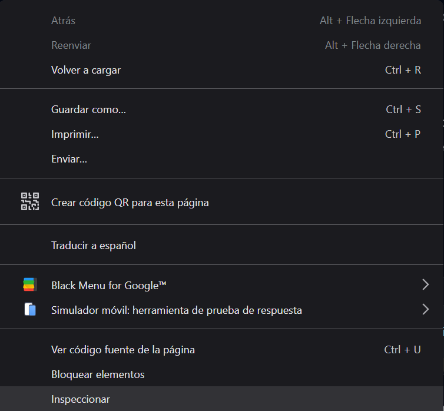

# ¿Cómo abrir el Inspector de Elementos?

El **Inspector de Elementos** está disponible en los principales navegadores y puede abrirse de distintas maneras según el sistema operativo y navegador que utilices.

---

## 📍 En Google Chrome

### Desde el clic derecho:
1. Haz clic derecho sobre cualquier parte de la página web.
2. Selecciona **"Inspeccionar"** o **"Inspeccionar elemento"**.

### Con atajo de teclado:
- **Windows / Linux:** `Ctrl + Shift + I` o `F12`
- **macOS:** `Cmd + Option + I`

---

## 🦊 En Mozilla Firefox

### Desde el clic derecho:
1. Haz clic derecho en la página.
2. Elige **"Inspeccionar"**.

### Atajo de teclado:
- **Windows / Linux:** `Ctrl + Shift + I` o `F12`
- **macOS:** `Cmd + Option + I`

---

## 🧭 En Microsoft Edge

- Igual que en Chrome: clic derecho → "Inspeccionar" o `F12`.

---

## 📱 En dispositivos móviles (modo simulación)

Aunque no puedes abrir directamente el inspector en un móvil, puedes simular un dispositivo móvil desde tu computadora:

1. Abre el inspector.
2. Haz clic en el ícono de **dispositivo móvil** (parece un celular y tablet).
3. Elige un dispositivo en el menú superior.

---

## 📝 Recomendación

Practica abriendo el inspector en diferentes páginas web. Así te vas familiarizando con su acceso y con la vista del código HTML y estilos CSS.

---

¡Listo! Ya sabes cómo abrir esta herramienta poderosa. Vamos a lo siguiente. 🔍
