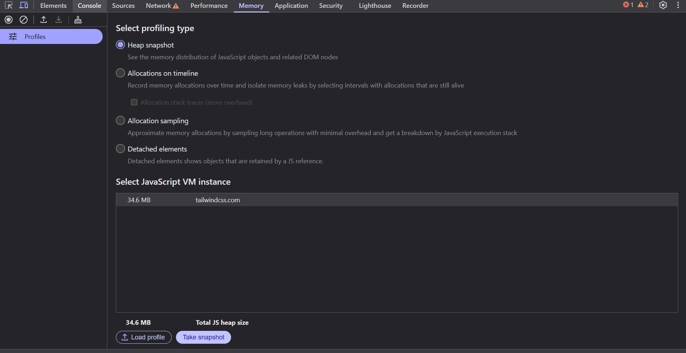

# Estructura Visual del Inspector de Elementos

El **Inspector de Elementos** tiene una interfaz dividida en varias áreas clave. Conocer cada una de ellas es esencial para navegar eficazmente y aprovechar al máximo esta herramienta.

---

## 1. Área Principal: El Panel de Inspección

El panel principal está dividido en varias pestañas, que contienen información diferente sobre la página web que estás analizando. Algunas de las más importantes son:

- **HTML**: Muestra la estructura de la página en forma de un árbol DOM.
- **CSS**: Permite ver y editar los estilos asociados con los elementos HTML.
- **Consola**: Muestra los mensajes de JavaScript, errores y otros mensajes de depuración.
- **Red**: Muestra las solicitudes HTTP que realiza la página (como imágenes, archivos JS, etc.).
  
---

## 2. Barra de Herramientas

En la parte superior del inspector, encontrarás una barra de herramientas con varios botones y opciones, entre ellas:

- **Seleccionar un elemento en la página**: Permite seleccionar cualquier elemento de la página haciendo clic en él.
- **Configuración de la vista**: Ajustes de visualización, como el modo oscuro o el tipo de dispositivo simulado.

---

## 3. Panel de Elementos (HTML y CSS)

La mayor parte del tiempo, trabajarás con el panel de **Elementos**, que está dividido en dos partes principales:

### a. Árbol DOM
Aquí puedes ver el código HTML de la página. Cada elemento HTML está representado en una estructura jerárquica. Puedes hacer clic en cualquier etiqueta para inspeccionarla más a fondo.

### b. Estilos CSS
En la parte derecha, verás los estilos CSS aplicados al elemento seleccionado. Podrás modificar estos estilos de manera instantánea, lo cual es útil para pruebas rápidas.

---

## 4. Otros Paneles Importantes

- **Consola**: Útil para ejecutar código JavaScript, depurar errores y ver las salidas de los `console.log`.

- **Red**: Muestra todas las solicitudes de la página, como imágenes, scripts y archivos CSS. Es útil para verificar tiempos de carga y problemas con recursos.

- **Rendimiento y Memoria**: Ayuda a analizar el rendimiento de la página, encontrar cuellos de botella y mejorar la eficiencia.

---

## 5. Consejos

- Usa las teclas de **flecha hacia arriba** o **hacia abajo** para moverte rápidamente por los elementos del árbol DOM.
- Experimenta con el modo **"Diseño responsivo"** para simular cómo se ve la página en diferentes dispositivos.

---

Conocer cómo navegar por estas áreas te permitirá depurar y modificar páginas web con mayor agilidad.

---

¡Ya conoces la estructura básica! Ahora, a explorar el inspector en acción. 🚀
