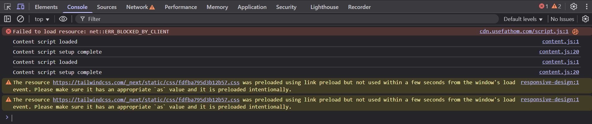

# Pestaña de Consola

La **Consola** del Inspector de Elementos es una herramienta esencial para los desarrolladores web. Permite ver mensajes del navegador, errores de JavaScript y también ejecutar código JavaScript en tiempo real.



---

## 1. ¿Para qué sirve la consola?

- Ver mensajes de depuración (`console.log`)
- Detectar errores de JavaScript en la página
- Ejecutar comandos directamente en el contexto de la página web
- Inspeccionar variables, objetos, arrays y funciones
- Realizar pruebas rápidas sin tener que modificar el código fuente

---

## 2. Interfaz básica

Cuando abres la pestaña **Consola**, verás un área grande con texto. Aquí aparecerán mensajes como:

- 🔹 `console.log()` – Para mostrar mensajes personalizados
- ❌ Errores – Como problemas con scripts, rutas, funciones mal escritas, etc.
- ⚠️ Advertencias – Mensajes que indican posibles problemas

---

## 3. Escribir código en la consola

Puedes escribir código directamente en la consola y presionar **Enter** para ejecutarlo.

Ejemplos simples:

```js
console.log("Hola mundo");  // Muestra un mensaje
document.body.style.backgroundColor = "red";  // Cambia el fondo de la página
