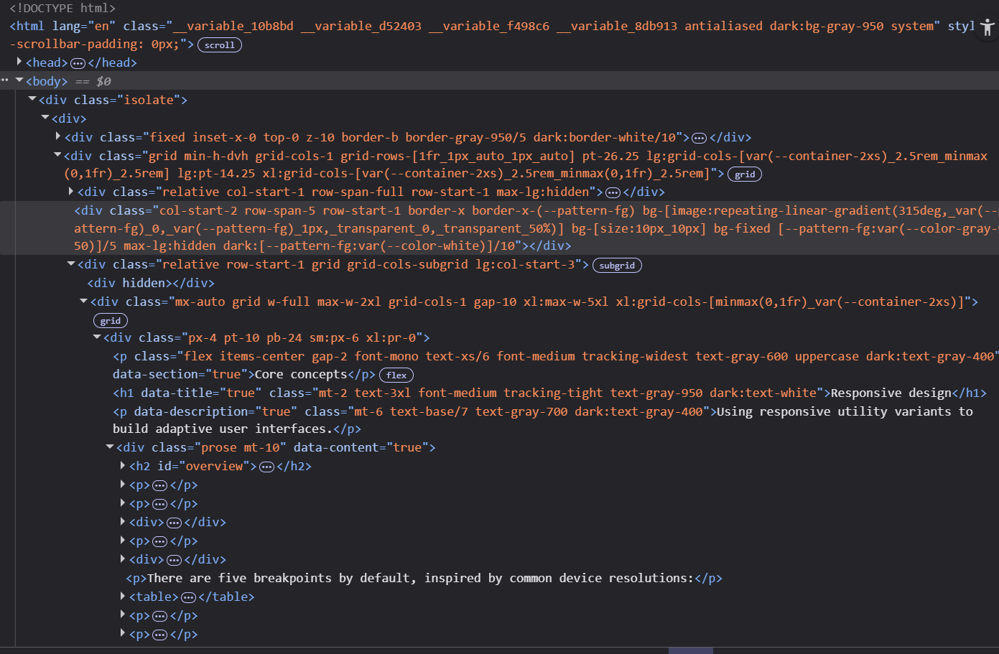
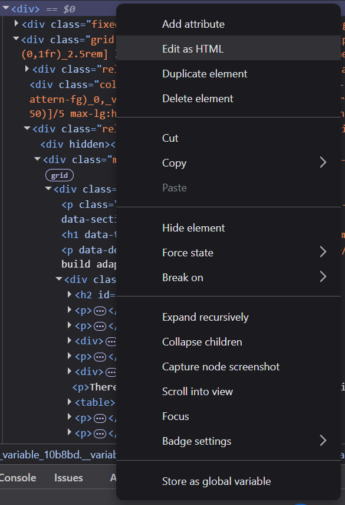
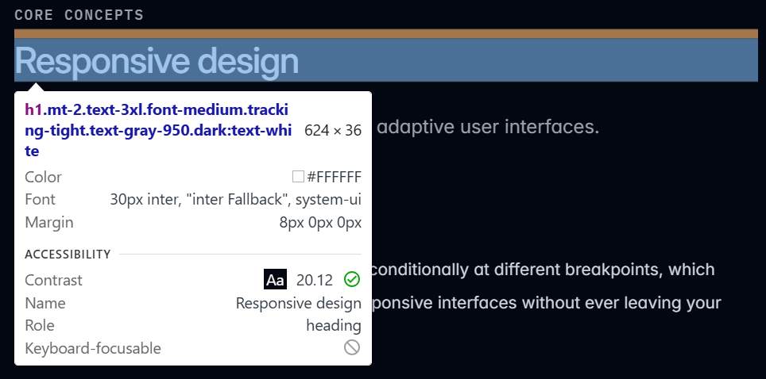
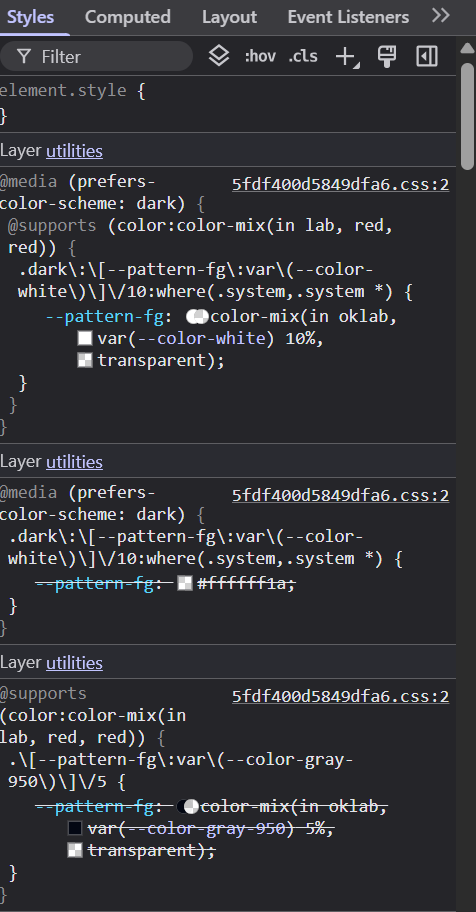

# Pestaña de Elementos

La **Pestaña de Elementos** es donde puedes ver la estructura HTML de la página web y hacer modificaciones en tiempo real. Esta pestaña es especialmente útil para inspeccionar y editar el contenido de una página web sin afectar la página real, ya que los cambios solo serán visibles en tu navegador.

---

## 1. ¿Qué puedes hacer en la pestaña de Elementos?

### a. Ver la estructura del HTML

En esta pestaña, verás el **árbol DOM** (Document Object Model) de la página. Cada etiqueta HTML está representada como un nodo dentro de este árbol. Podrás navegar por él para encontrar cualquier elemento de la página, como encabezados, párrafos, imágenes, botones, etc.

### b. Modificar el HTML

Puedes **editar el HTML** directamente desde el inspector. Solo tienes que hacer clic derecho sobre un elemento del árbol y elegir **"Editar como HTML"**. Esto te permitirá modificar el contenido de la página temporalmente.

### c. Añadir nuevos elementos

Puedes añadir nuevos elementos HTML directamente en el árbol, ya sea copiando y pegando código o escribiéndolo desde cero. Para agregar un nuevo nodo, haz clic derecho sobre un nodo existente y selecciona **"Añadir nodo"**.

---

## 2. Interacción con el HTML

### a. Seleccionar un elemento en la página

En la parte superior de la pestaña de Elementos, encontrarás un icono de un cursor (parece un cuadrado con una flecha). Haz clic en este icono y luego selecciona cualquier elemento en la página. Al hacerlo, el inspector se desplazará automáticamente a esa parte del árbol DOM y te mostrará el código correspondiente.

### b. Resaltar elementos

Cuando seleccionas un elemento en el árbol, también se resalta visualmente en la página web. Esto te ayuda a ver rápidamente qué parte del HTML corresponde a qué sección de la interfaz de usuario.

---

## 3. Modificar estilos desde la pestaña de Elementos

En la pestaña de Elementos, verás la sección de **Estilos** a la derecha del árbol DOM. Esta sección muestra todos los estilos CSS aplicados al elemento seleccionado. Puedes hacer lo siguiente:

- **Activar/desactivar reglas CSS**: Haz clic en las casillas al lado de las reglas CSS para activarlas o desactivarlas temporalmente.
- **Editar estilos**: Puedes modificar cualquier valor de estilo, como los colores, márgenes, fuentes, etc. Los cambios se aplicarán inmediatamente en la página.
- **Añadir nuevos estilos**: Puedes escribir nuevas reglas CSS en la parte inferior de la sección de estilos y aplicarlas al elemento seleccionado.

---

## 4. Consejos útiles

- Usa la función de **búsqueda** en la parte superior del panel de elementos para encontrar rápidamente un elemento en el árbol DOM.
- Recuerda que **los cambios realizados en el inspector son temporales**, por lo que no afectarán la página cuando la recargues.
- Si cometes un error, puedes hacer **Ctrl + Z** (Windows) o **Cmd + Z** (Mac) para deshacer cambios.

---

Con esta pestaña, puedes experimentar y modificar el contenido de la página de forma rápida y sin comprometer los archivos originales.

---

¡Ahora estás listo para editar y explorar los elementos de una página web de forma eficiente! 🛠️
