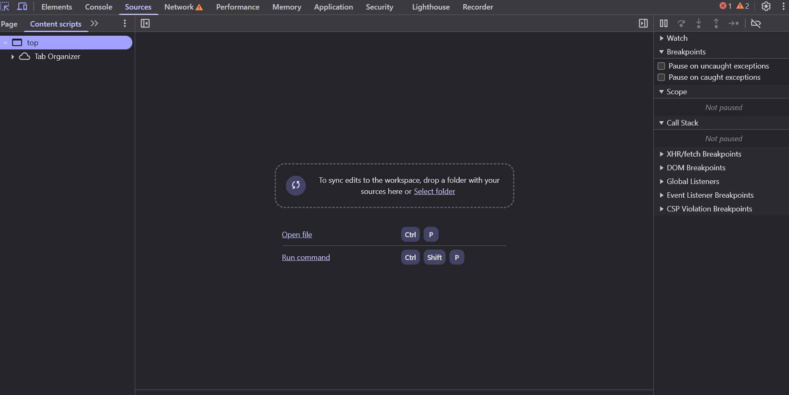

# Pestaña de Fuente (Sources)

La **Pestaña de Fuente** te permite ver, explorar y depurar el código fuente de una página web. Aquí puedes encontrar los archivos JavaScript, HTML, CSS, e incluso imágenes y fuentes utilizadas por el sitio.



---

## 1. ¿Qué puedes hacer en la pestaña de Fuente?

- Ver todos los archivos que componen una página web.
- Colocar puntos de interrupción (**breakpoints**) para depurar scripts paso a paso.
- Ver archivos minificados y desminificarlos.
- Añadir `watch expressions` para observar variables.
- Simular pausas y controlar la ejecución de scripts.

---

## 2. Estructura de la pestaña

En el panel izquierdo encontrarás un **explorador de archivos**, organizado por dominio. Dentro verás carpetas como:

- `/js/` – Archivos JavaScript
- `/css/` – Estilos
- `/img/` – Imágenes
- `/fonts/` – Fuentes

Y más, dependiendo del sitio web.

---

## 3. Visualizar y editar código

Puedes abrir cualquier archivo con solo hacer clic sobre él. Aunque no puedes guardar los cambios directamente en el servidor (por motivos de seguridad), sí puedes editar y ver cómo se comporta el nuevo código en el navegador.

```js
// Ejemplo de código editable
function saludar() {
  console.log("¡Hola desde el navegador!");
}

