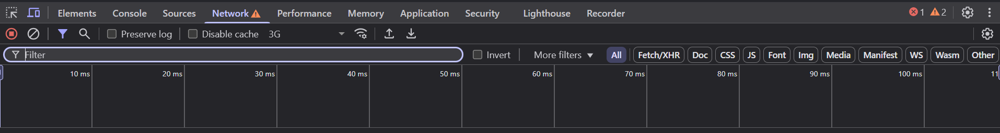

# Pestaña de Red (Network)

La **Pestaña de Red** permite observar todas las solicitudes (requests) que hace una página web mientras se carga o mientras interactúas con ella. Es ideal para analizar rendimiento, detectar errores de conexión o ver cómo se comunican los formularios, APIs y otros recursos.



---

## 1. ¿Qué se puede ver en esta pestaña?

Cuando abres la pestaña **Red (Network)**, y recargas la página, podrás ver una lista detallada de todos los archivos que la página solicita:

- Archivos HTML
- Imágenes (JPG, PNG, SVG, etc.)
- Archivos CSS
- Scripts JavaScript
- Fuentes
- Llamadas a APIs (por ejemplo, datos en formato JSON)

---

## 2. Información que se muestra

Cada recurso cargado aparece con datos importantes:

| Columna | Descripción |
|---------|-------------|
| **Name** | Nombre del archivo o recurso |
| **Status** | Código de respuesta HTTP (200, 404, 500, etc.) |
| **Type** | Tipo de archivo (document, script, stylesheet, image, etc.) |
| **Size** | Tamaño del recurso |
| **Time** | Tiempo que tardó en cargarse |
| **Waterfall** | Gráfico visual del orden y duración de cada carga |

---

## 3. Filtros y herramientas útiles

La pestaña tiene varias herramientas que te ayudan a filtrar y analizar mejor la información:

- 🔍 **Filtro por tipo**: Solo ver imágenes, scripts, XHR (peticiones AJAX), etc.
- 🔄 **Recargar con Network abierto**: Esto permite ver todo lo que se carga desde el inicio.
- ✅ **Disable cache**: Desactiva la caché para ver cómo se cargaría todo desde cero.
- 📦 **Preview y Response**: Si haces clic en una solicitud (por ejemplo, de una API), puedes ver la respuesta, el encabezado (headers), y más detalles.

---

## 4. Analizar APIs y peticiones AJAX

Si tu página hace peticiones a servidores (por ejemplo, para cargar datos con fetch o Axios), las verás bajo la categoría **XHR** o **Fetch**.

Ejemplo:

```js
fetch("https://api.ejemplo.com/usuarios")
  .then(res => res.json())
  .then(data => console.log(data));
