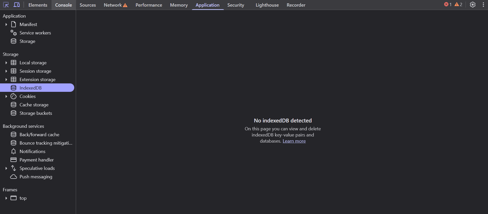
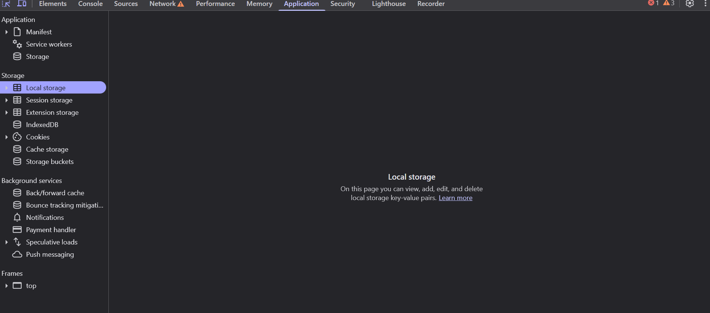

# Explorando la pestaña Application

La pestaña **Application** te permite inspeccionar todo lo que una página guarda en tu navegador: cookies, almacenamiento local, bases de datos, archivos en caché, íconos, y más.

Es especialmente útil para desarrolladores web que trabajan con sesiones, tokens, o aplicaciones que guardan datos del usuario en el navegador.



---

## 1. ¿Qué puedes encontrar aquí?

En la barra lateral izquierda encontrarás distintas secciones como:

- **Manifest**: Muestra el archivo `manifest.json` si la web es una PWA (Progressive Web App).
- **Service Workers**: Permite ver o controlar *workers* que corren en segundo plano.
- **Storage**:
  - `Local Storage`: Guarda datos clave-valor que persisten aunque recargues la página.
  - `Session Storage`: Igual que el anterior, pero se borra al cerrar la pestaña.
  - `IndexedDB`: Base de datos en el navegador para guardar datos más complejos.
  - `Cookies`: Toda la info que el sitio guarda como sesiones, tokens, preferencias, etc.
  - `Cache Storage`: Archivos que se guardan en caché (generalmente usados por PWAs).

---

## 2. Cómo ver datos guardados

1. Abre el inspector (`Ctrl + Shift + I`).
2. Ve a la pestaña **Application**.
3. En la barra lateral izquierda, haz clic en alguna opción como `Local Storage`.
4. Selecciona el dominio del sitio actual.
5. Se mostrará una tabla con claves y valores guardados.



---

## 3. ¿Puedo modificar o borrar datos?

¡Sí! Puedes:

- Hacer **doble clic** sobre una celda para editar un valor.
- **Clic derecho** para agregar o eliminar claves.
- Usar el botón **"Clear storage"** para eliminar todos los datos del sitio actual.

---

## 4. Ejemplo de uso práctico

Un sitio puede guardar un token en `localStorage` así:

```js
localStorage.setItem("token", "eyJhbGciOiJIUz...");

