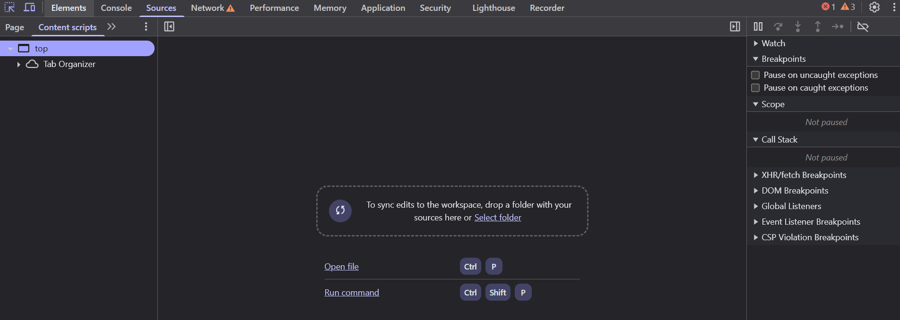

# Depuración Avanzada con la Pestaña Sources

La pestaña **Sources** es donde se hace el trabajo de depuración (debugging) más avanzado. Aquí puedes inspeccionar, pausar, modificar y ejecutar código JavaScript en vivo. Es la herramienta de los desarrolladores cuando necesitan rastrear errores complejos, entender cómo se ejecuta el código y optimizar su funcionamiento.

---

## 1. ¿Qué puedes hacer en la pestaña Sources?

- **Ver y editar código fuente**: Puedes revisar y modificar los archivos JavaScript y otros recursos cargados en la página.
- **Usar breakpoints (puntos de interrupción)**: Detener la ejecución de un script en una línea específica para inspeccionar el estado.
- **Ver el call stack (pila de llamadas)**: Ver el historial de funciones que se han llamado para llegar a la línea donde se encuentra el breakpoint.
- **Monitorear variables**: Observar cómo cambian las variables durante la ejecución.
- **Crear y ejecutar snippets de código**: Puedes escribir y ejecutar pequeños fragmentos de código directamente en el navegador.

---

## 2. Depuración con Breakpoints

Los **breakpoints** son puntos en tu código donde puedes hacer que la ejecución se detenga, lo que te permite inspeccionar el estado de la aplicación en ese momento.

### ¿Cómo agregar un breakpoint?

1. Abre el archivo JavaScript desde el panel izquierdo de **Sources**.
2. Haz clic en el número de la línea donde quieras que se detenga la ejecución.
3. Recarga la página o ejecuta la acción que active el script.
4. La ejecución se detendrá en ese punto, y podrás inspeccionar el estado del código.

---

## 3. Call Stack (Pila de llamadas)

El **call stack** muestra la secuencia de funciones que se han llamado para llegar al punto donde se detuvo el código. Cada vez que una función llama a otra, se agrega a la pila.

- Puedes ver cómo se llegan a los errores.
- Facilita la navegación por el código.
- Te ayuda a entender la secuencia de ejecución y a encontrar errores en el flujo del programa.

---

## 4. Watch Expressions (Expresiones a vigilar)

En el panel de **Watch**, puedes agregar expresiones para monitorear ciertas variables o resultados en tiempo real mientras se ejecuta el código.

- **¿Cómo añadir una expresión?**: En el panel de **Watch**, haz clic en "Add Expression" y escribe el nombre de la variable o la expresión que deseas monitorear.
- Ejemplo: Puedes vigilar `user.name` para ver cómo cambia durante la ejecución del script.

---

## 5. Snippets (Fragmentos de código)

Puedes guardar y ejecutar fragmentos de código pequeños directamente en la pestaña **Sources**. Esto es útil para probar código sin tener que editar los archivos originales.

### ¿Cómo crear un snippet?

1. Ve al panel de **Sources** y desplázate hacia abajo hasta la sección **Snippets**.
2. Haz clic derecho → "New".
3. Escribe tu código y haz clic en "Run" para ejecutarlo.

---

## 6. Depuración de código asincrónico

El código JavaScript asincrónico (como las promesas o `setTimeout`) puede ser más difícil de depurar. Sin embargo, puedes seguir su flujo utilizando **breakpoints condicionales**.

- Los **breakpoints condicionales** solo se activan cuando se cumple una condición específica. Por ejemplo, puedes poner un breakpoint que solo se active si una variable tiene cierto valor.
  
  > Para agregar un breakpoint condicional, haz clic derecho sobre el número de línea y selecciona "Add conditional breakpoint".

---

## 7. Consejos para una depuración eficaz

✅ Usa **puntos de interrupción condicionales** para depurar situaciones complejas.  
✅ Si el código es muy grande, utiliza la **búsqueda** en el panel de **Sources** para encontrar funciones o variables rápidamente.  
✅ Los **snippets** son geniales para probar pequeñas porciones de código sin interferir con el sitio en vivo.  
✅ Monitorea **expresiones** para hacer un seguimiento de variables clave sin tener que detenerte constantemente.

---

## 🎯 ¿Cuándo usar la pestaña Sources?

- Para **depurar código** paso a paso, línea por línea.
- Cuando necesitas analizar **errores complejos** en JavaScript.
- Para verificar cómo se comporta el código bajo ciertas condiciones o interacciones.
- Cuando trabajas con **código asincrónico** y quieres seguir su flujo.

---

La pestaña **Sources** es tu mejor amigo cuando se trata de depurar y entender cómo funciona el código JavaScript en una página. Con un poco de práctica, te permitirá desentrañar hasta los problemas más difíciles. 💻🔍
