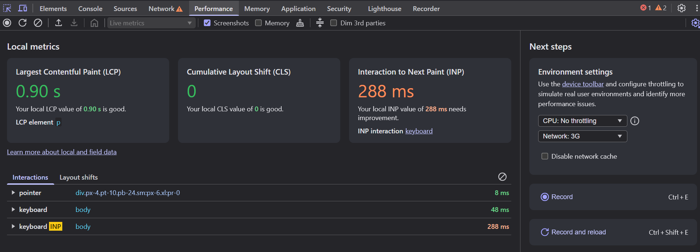

# Analizando el Rendimiento con la Pestaña Performance

La pestaña **Performance** del Inspector de Elementos permite medir y analizar el comportamiento de carga y ejecución de una página web. Es una herramienta esencial cuando necesitas mejorar el tiempo de respuesta o detectar procesos pesados que afectan la experiencia del usuario.

---

## 1. ¿Dónde está y para qué sirve?

La pestaña **Performance** se encuentra entre las pestañas principales del inspector. Con ella puedes:

- Medir el tiempo de carga de una página.
- Ver qué recursos tardan más en procesarse.
- Detectar tareas largas, bloqueos o "jank" (saltos en la fluidez).
- Analizar el uso de CPU y memoria durante un periodo de tiempo.

---

## 2. ¿Cómo usarla?

### 🔴 Paso 1: Comenzar una grabación

1. Abre el inspector (`Ctrl + Shift + I`).
2. Ve a la pestaña **Performance**.
3. Haz clic en el botón de grabar 🔴.
4. Recarga la página o interactúa con ella.
5. Detén la grabación.

> Esto generará un análisis completo de todo lo que pasó mientras grababas.

---

### 📊 Paso 2: Interpretar los resultados

Una vez que grabes, verás algo como esto:

- **Timeline (línea de tiempo)**: Muestra lo que ocurrió segundo a segundo.
- **Frames**: Indica si la página estaba fluyendo bien (60 fps) o se trabó.
- **Main Thread**: Aquí puedes ver tareas como procesamiento de JavaScript, renderizado, cálculo de estilos, etc.
- **Bottom-Up y Call Tree**: Para ver funciones que consumieron más recursos.

---

## 3. Identificar problemas comunes

- **Tareas muy largas (Long tasks)**: Tardan más de 50ms. Suelen causar trabas o lags.
- **Reflows**: Cambios frecuentes en el layout. Ocurren si manipulas el DOM muchas veces seguidas.
- **Tiempo hasta interacción (TTI)**: ¿Cuánto tarda en estar lista la página para que el usuario la use?

---

## 4. Consejos prácticos

✅ Mantén tus scripts optimizados y evita bucles pesados.  
✅ No recargues muchos recursos innecesarios (imágenes pesadas, scripts externos).  
✅ Minimiza el uso de animaciones innecesarias.  
✅ Usa `requestAnimationFrame()` para animaciones suaves.  
✅ Usa `Web Workers` si necesitas procesos pesados sin bloquear el hilo principal.

---

## 🧪 ¿Cuándo usar Performance?

- Cuando una web se siente lenta o se traba.
- Al hacer pruebas de optimización.
- Para medir mejoras después de hacer cambios.

---

La pestaña **Performance** es como una lupa para ver qué está pasando detrás del telón cuando una web se carga o se mueve. Si aprendes a leer sus gráficas, te conviertes en un experto en rendimiento web 🔥.
