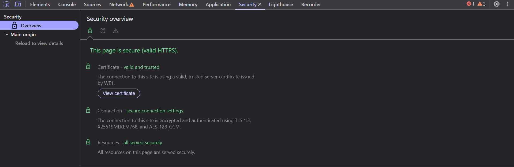

# Revisando Seguridad con la Pestaña Security

La pestaña **Security** es ideal para comprobar el estado de seguridad de una página web, mostrando información sobre el certificado SSL/TLS, la conexión segura (HTTPS), y más. Es útil para desarrolladores y auditores de seguridad.

---

## 1. ¿Qué puedes ver en la pestaña Security?

Dentro de la pestaña **Security**, podrás observar:

- **HTTPS**: Indica si la página usa una conexión segura (SSL/TLS).
- **Certificado**: Muestra detalles sobre el certificado SSL/TLS, como el emisor, la fecha de expiración, y la validez.
- **Conexión segura**: Verás si la conexión está cifrada correctamente.
- **Cabeceras de seguridad**: Como `Strict-Transport-Security` (HSTS), que indica políticas de seguridad.
- **Subrecursos**: Si los recursos de la página (como imágenes, scripts) se cargan de manera segura.

---

## 2. ¿Cómo acceder a esta pestaña?

1. Abre el inspector (`Ctrl + Shift + I`).
2. Ve a la pestaña **Security**.
3. Si la página está usando HTTPS, verás detalles sobre el certificado y la conexión.

---

## 3. Información detallada del certificado

Cuando haces clic en "View certificate" (Ver certificado), podrás ver:

- **Información del emisor**: Quién emitió el certificado SSL.
- **Fecha de expiración**: La fecha en la que el certificado dejará de ser válido.
- **Propósito**: Asegura que el certificado es válido para conexiones de servidor web.
- **Ruta de confianza**: Cómo los navegadores confían en el certificado.

---

## 4. ¿Por qué es importante HTTPS?

El **HTTPS** es crucial para proteger la información de los usuarios al asegurar que:

- La **conexión** entre el servidor y el navegador está cifrada.
- Los datos no pueden ser **interceptados** por atacantes (mitigando ataques como el "Man-in-the-Middle").
- Los **sitios web legítimos** pueden ser verificados a través de su certificado SSL/TLS, lo que ayuda a prevenir el phishing.

---

## 5. Consejos de seguridad

✅ **Siempre usa HTTPS**: Asegúrate de que tu sitio tenga un certificado SSL válido.  
✅ **HSTS**: Implementa HTTP Strict Transport Security para forzar HTTPS en futuras visitas.  
✅ **CORS**: Verifica que tu servidor esté configurado para manejar correctamente las políticas de CORS (Cross-Origin Resource Sharing).  
✅ **Política de contenido de seguridad**: Implementa una política de seguridad que prevenga ataques de tipo Cross-Site Scripting (XSS).

---

## 🎯 ¿Cuándo usar la pestaña Security?

- Para verificar que tu sitio está utilizando HTTPS correctamente.
- Cuando quieras comprobar la validez del certificado SSL.
- Para identificar posibles problemas de seguridad en la configuración del servidor.
- Para revisar si los recursos externos están siendo cargados de forma segura.

---

Con la pestaña **Security**, puedes garantizar que tu página está protegida y cumplir con las mejores prácticas de seguridad para proteger a los usuarios y sus datos. ¡Nunca subestimes la seguridad en la web! 🔒🌐
